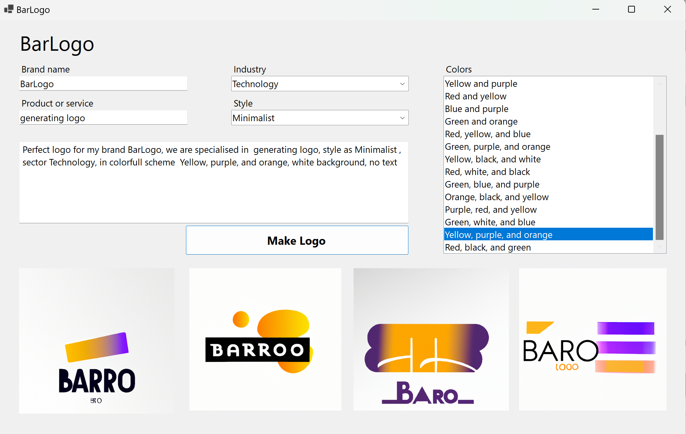

# BarLogo

BarLogo is a C# .NET Core 7 application that uses the [Dalle2](https://github.com/dalle2/dalle2) library to generate unique logos using a combination of geometric shapes and colors. The application was developed using [Visual Studio](https://visualstudio.microsoft.com/).

BarLogo allows you to specify a color scheme, logo style, business name, and industry to generate logos tailored to your needs.

## Installation

To install BarLogo, you will need to have the [.NET Core 7 runtime](https://dotnet.microsoft.com/download/dotnet/7.0) installed on your machine.

To run the application, clone the repository and navigate to the project directory. Then, use the following command: dotnet run
 
Alternatively, you can build the application and run the resulting executable file.

## Development

To develop BarLogo, you will need to have the [.NET Core 7 SDK](https://dotnet.microsoft.com/download/dotnet/7.0) and [Visual Studio 2019](https://visualstudio.microsoft.com/) or later installed on your machine. You will also need to install the .NET Core cross-platform development workload in Visual Studio.

To build the application, open the solution file in Visual Studio and use the "Build" menu or the keyboard shortcut Ctrl+Shift+B. To run the application, use the "Debug" menu or the keyboard shortcut F5.

To run the tests, use the following command: dotnet test

To contribute to BarLogo, fork the repository and create a pull request with your changes. Please make sure to include tests for any new functionality and ensure that all tests pass before submitting your pull request.

## Usage

To use BarLogo, run the application and follow the prompts to generate a logo. You can specify a color scheme, logo style, business name, and industry to tailor the generated logo to your needs. The logo will be saved to a file in the current directory.

For more detailed usage examples, see the documentation and the included sample programs.

