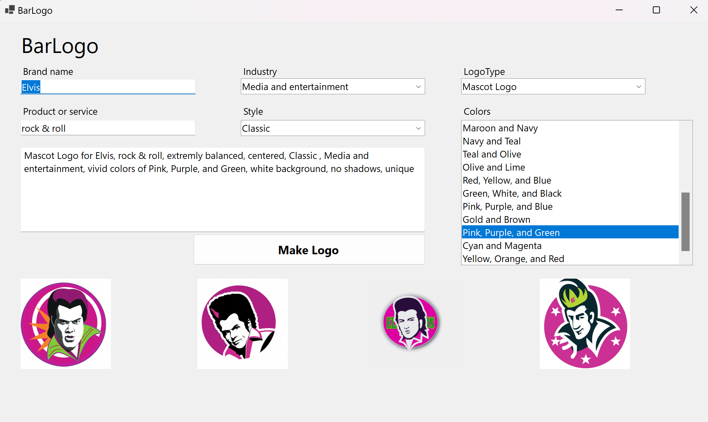

# BarLogo
 
BarLogo allows you to specify a color scheme, logo style, business name, and industry to generate logos tailored to your needs.

## Installation

To install BarLogo, you will need to have the [.NET Core 7 runtime](https://dotnet.microsoft.com/download/dotnet/7.0) installed on your machine.

To run the application, clone the repository and navigate to the project directory. Then, use the following command: dotnet run
 
Alternatively, you can build the application and run the resulting executable file.
 

## Usage

To use BarLogo, run the application and follow the prompts to generate a logo. You can specify a color scheme, logo style, business name, and industry to tailor the generated logo to your needs. The logo will be saved to a file in the current directory.

For more detailed usage examples, see the documentation and the included sample programs.

